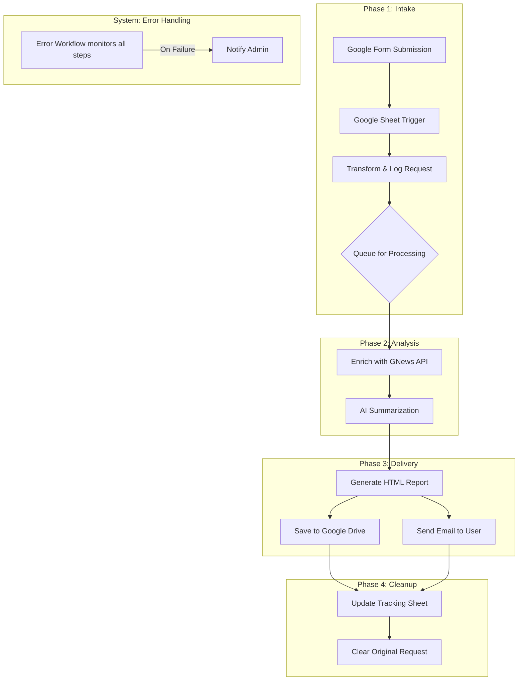

# Competitor Tracker - A Scalable Intelligence Automation PoC

## 1. Executive Summary

The Competitor Tracker is a proof-of-concept (PoC) project designed to automate the process of gathering, analyzing, and delivering competitive intelligence. It leverages a modern, scalable architecture built on **n8n.io**, hosted on a **Google Cloud Platform (GCP) E2-Micro VM**, and deeply integrated with **Google Workspace APIs** (Sheets, Drive, and Gmail).

This system automatically fetches information about competitors listed in a Google Sheet, enriches it with the latest news, generates an AI-powered strategic brief, and distributes the report via email and Google Drive. The project demonstrates a robust, event-driven architecture with built-in queuing and error handling, showcasing a comprehensive understanding of the **Software Development Life Cycle (SDLC)** and modern IT project management principles.

## 2. Project Philosophy & Goals

This project was developed following the **Minimum Viable Product (MVP)** framework. The primary goal was to validate the core functionality and technical feasibility of an automated intelligence pipeline with minimal initial investment.

### Key Objectives:
- **Prove Viability**: Demonstrate that a complex workflow involving multiple cloud services can be reliably automated.
- **Showcase Cloud Integration**: Exhibit proficiency in integrating various Google Cloud and third-party APIs.
- **Establish a Scalable Foundation**: Build a system with an architecture (e.g., queuing, modular workflows) that can be easily scaled.
- **Automate Manual Effort**: Eliminate the time-consuming manual process of tracking competitor activities.

## 3. System Architecture & Design

The architecture is designed for modularity and resilience. At its core is an n8n instance running on a GCP virtual machine, which acts as the orchestration engine.

### Core Components:
- **Orchestration Engine**: **n8n.io**, running as a **Docker container** hosted on a **GCP E2-Micro VM**. This provides a consistent, isolated, and portable environment for the automation workflow.
- **Data Ingestion**: **Google Forms & Sheets**. A simple user interface for submitting competitor tracking requests.
- **Data Enrichment**: **GNews API**. Fetches recent news articles to provide up-to-date context for the analysis.
- **AI Analysis**: **OpenRouter API** (using `deepseek/deepseek-r1`). Performs the core task of analyzing the gathered data and generating a strategic brief.
- **Data Storage & Logging**: **Google Drive & Google Sheets**. All generated reports and source data are archived for debugging, auditing, and potential user retargeting.
- **Notification**: **Gmail API**. Delivers the final report directly to the user's inbox.

### Architecture Diagram

## 4. Workflow Deep Dive

The automation is handled by two primary n8n workflows: the Main Competitor Tracker workflow and a dedicated Error Handling workflow. This separation of concerns is a key design choice for maintainability.

### Main Workflow
1.  **Trigger**: The workflow initiates when a new row is added to the "Form Responses" Google Sheet.
2.  **Data Transformation**: A Code node cleans and structures the raw data from the sheet, extracting fields like competitor name, industry, and user email.
3.  **Queuing System**: The workflow uses a "Split in Batches" node configured to a batch size of 1. This powerful feature ensures that only **one competitor is processed at a time**, preventing system overload and respecting API rate limits.
4.  **Data Enrichment**: An HTTP Request node calls the GNews API to search for recent news related to the competitor.
5.  **AI Analysis & Prompt Engineering**: The aggregated data is sent to the OpenRouter API. A sophisticated **system prompt** instructs the AI to act as a senior strategy consultant and generate a professional-grade HTML report with a specific, executive-friendly structure.
6.  **File Generation**: The AI's text response is converted into a binary HTML file, ready for distribution.
7.  **Archiving**: The generated HTML brief is uploaded to a dedicated "Competitor Briefs" folder in Google Drive for logging and record-keeping.
8.  **Email Notification**: The HTML brief is sent directly to the requester's email address.

### Error Handling Workflow
A separate, dedicated workflow is triggered whenever any node in the main workflow fails.
-   **Notification**: It immediately sends a detailed error notification to a designated admin email address.
-   **Details**: The notification includes the name of the workflow that failed, the specific node that failed, and a link to the execution log.
-   **Proactive Maintenance**: This enables proactive monitoring and rapid debugging, ensuring system reliability.

## 5. SDLC & Project Management

This project, while a PoC, was executed with a structured approach that reflects the key phases of the **Software Development Life Cycle (SDLC)**.

-   **1. Planning**: The project scope was clearly defined: create an automated pipeline for competitor analysis. The technology stack (GCP, n8n, Google APIs) was chosen for its rapid development capabilities, low cost, and scalability.
-   **2. Design**: The architecture was designed with scalability and resilience in mind, incorporating a queuing mechanism and decoupled error handling from the start.
-   **3. Development**: The n8n workflows were built iteratively, with each node representing a distinct function in the pipeline. Code nodes were used for custom data transformation, demonstrating flexibility beyond standard nodes.
-   **4. Testing**: Each node was tested individually within the n8n canvas. The end-to-end flow was tested using sample data in the Google Form. The archival of data to Google Drive serves as a log for debugging failed runs.
-   **5. Deployment**: The project is "deployed" on a live GCP E2-Micro VM instance, making it an operational service. Docker and Docker Compose files are included to facilitate easy redeployment or migration.
-   **6. Maintenance**: The proactive error-notification workflow is a core component of the maintenance strategy, ensuring that the system administrator is immediately aware of any issues.

## 6. Scalability & Future Work

The current architecture provides a strong foundation for future expansion.

### Potential Enhancements:
-   **Add More Data Sources**: Integrate additional data sources like **Reddit**, **Twitter**, or financial data APIs (e.g., Finnhub, Alpha Vantage) to provide a more holistic analysis. This would simply involve adding more data-fetching nodes before the AI summarization step.
-   **Advanced Container Scaling**: For higher throughput, migrate the existing containerized application from a single VM to a managed, auto-scaling service like **Google Cloud Run** or **Kubernetes Engine (GKE)**.
-   **Advanced Analytics**: Implement a frontend dashboard (e.g., using Google Looker Studio or Retool) to visualize trends from the data stored in Google Sheets.
-   **Configuration Management**: Move static configurations (like API endpoints or search queries) into a separate `competitors.yaml` configuration file to allow for easier updates without modifying the workflow itself.

This project successfully demonstrates the rapid development of a powerful, scalable, and reliable automation service using modern cloud technologies and sound architectural principles. 